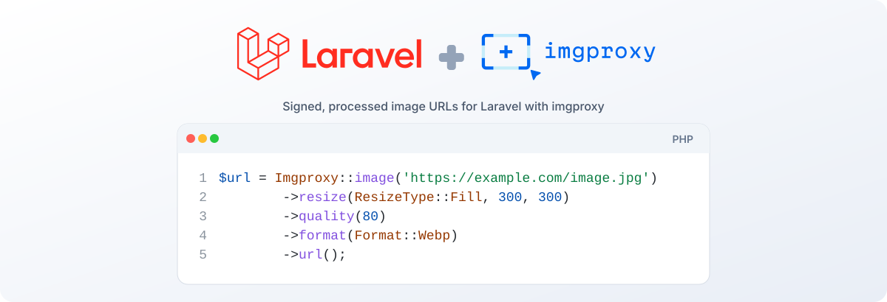

<p align="center">
    <picture>
        <source media="(prefers-color-scheme: dark)" srcset="art/banner-dark.svg" />
        
    </picture>
</p>

<p align="center">
    <a href="https://packagist.org/packages/imsus/laravel-imgproxy"></a>
    <a href="https://packagist.org/packages/imsus/laravel-imgproxy"></a>
    <a href="https://packagist.org/packages/imsus/laravel-imgproxy"></a>
    <a href="https://github.com/imsus/laravel-imgproxy/actions"></a>
    <a href="https://packagist.org/packages/imsus/laravel-imgproxy"></a>
</p>

imgproxy integration for Laravel. Generate signed, processed image URLs with an immutable fluent builder, render responsive `` and `<picture>` tags with LQIP placeholders, and build sources from any Storage disk — public disks get plain URLs, private disks get pre-signed temporary URLs.

## Requirements

- PHP ^8.4
- Laravel 13
- An imgproxy server (v4 recommended; the option segments target the v4 processing docs)

## Installation

You can install the package via Composer:

```bash
composer require imsus/laravel-imgproxy:^2.0
```

> **Using 1.x?** v1 stays available. Pin `^1.0` to keep the last 1.x release, or `1.x-dev` for the maintenance branch. v1 requires PHP ^8.2 and Laravel 10–12; v2 requires PHP ^8.4 and Laravel 13. The v1 source lives on the [`1.x` branch](https://github.com/imsus/laravel-imgproxy/tree/1.x), and its Packagist versions remain published. Migrating? See [UPGRADING](UPGRADING.md).

Publish the configuration file:

```bash
php artisan vendor:publish --tag="laravel-imgproxy-config"
```

You may publish all of the package's resources at once:

```bash
php artisan vendor:publish --tag="laravel-imgproxy"
```

The component templates publish to `resources/views/vendor/imgproxy` (the `laravel-imgproxy-views` tag) and override the package defaults.

## Configuration

The default instance reads its connection details from the environment, so the package works after setting three variables:

```dotenv
IMGPROXY_URL=https://imgproxy.example.com
IMGPROXY_KEY=943b421c9eb07c830af81030552c86009268de4e532ba2ee2eab8247c6da0881
IMGPROXY_SALT=520f986b998545b4785e0defbc4f3c1203f22de2374a3d53cb7a7fe9fea309c5
```

`IMGPROXY_KEY` and `IMGPROXY_SALT` are the hex-encoded values configured on the imgproxy server. When they are absent, URLs are generated unsigned with an `unsafe` signature slot — fine for local development, but configure them for anything exposed to the internet. Use `php artisan imgproxy:key` to generate a fresh pair.

The published `config/laravel-imgproxy.php` supports multiple named instances, each with its own server, credentials, signature size, and encoding:

```php
'instances' => [
    'default' => [
        'url' => env('IMGPROXY_URL'),
        'key' => env('IMGPROXY_KEY'),
        'salt' => env('IMGPROXY_SALT'),
        'signature_size' => null,
        'encoding' => 'base64',
    ],

    'staging' => [
        'url' => 'https://imgproxy-staging.example.com',
        'key' => '...',
        'salt' => '...',
        'signature_size' => 16, // match IMGPROXY_SIGNATURE_SIZE on the server
        'encoding' => 'base64',
    ],
],
```

Per-instance options:

- `url` — base URL of the imgproxy server, without a trailing slash.
- `key` / `salt` — hex-encoded HMAC credentials; `null` generates unsigned URLs.
- `signature_size` — signature bytes to keep (1–32), matching the server's `IMGPROXY_SIGNATURE_SIZE`; `null` keeps the full digest.
- `encoding` — source encoding: `base64` (URL-safe, no padding, the default) or `plain` (percent-encoded source behind a `plain/` prefix).

Named presets — reusable sets of processing options defined in config and shared across instances — are also supported. See the [documentation](#documentation) for details.

## Quick Start

The `Imgproxy` facade and the `imgproxy()` helper both resolve the default instance:

```php
use Imsus\LaravelImgproxy\Imgproxy;

$url = Imgproxy::image('https://example.com/image.jpg')
    ->cover(300, 300)
    ->quality(80)
    ->toWebp()
    ->url();

// https://imgproxy.example.com/unsafe/rs:fill:300:300/q:80/f:webp/aHR0cHM6Ly9leGFtcGxlLmNvbS9pbWFnZS5qcGc
```

The builder exposes **two API layers**. The headline is the *intent* layer: high-level methods that express the desired outcome in domain terms (`cover`, `fit`, `orient`, `toWebp`, `storePublicly`, …) and compile down to imgproxy option segments. When an intent method isn't wired up — or you know exactly which wire option you want — drop down to the typed *processing-option* layer, where every imgproxy v4 option has one validating method (resize, crop, gravity, blur, watermark, format, and more). Enum arguments accept the enum or its string value interchangeably (`Gravity::Smart` and `'sm'` produce the same URL). For options not yet covered, `withOption()` appends a segment verbatim. `url()` and `__toString()` return the full URL; either works as a terminal call.

Both layers are immutable, so every mutation returns a new instance. A base builder can be reused for several variants without accidental mutation:

```php
$base = Imgproxy::image('https://example.com/image.jpg')->quality(80);

$small = $base->width(320)->url();
$large = $base->width(1280)->url(); // quality:80 still applies; no width leak from $small
```

### Signing

With a key and salt configured, the `unsafe` slot is automatically replaced by an HMAC-SHA256 signature:

```php
// https://imgproxy.example.com/7Fu-sZuoCXRc1LXWhM687mlhsd2SFxXBpiFjJk6vakw/rs:fill:300:300/...
```

The signature covers the exact path emitted, so encoding choice and signing are computed together. `signature_size` truncates the signature to match the server; an empty key or salt disables signing.

### Storage Disks

Sources can come from any Laravel Storage disk. Public disks yield the disk's `url()`; private disks yield a pre-signed `temporaryUrl()`. The Storage macro is the most direct form:

```php
use Illuminate\Support\Facades\Storage;

// Public disk -> url()
Storage::disk('public')->imgproxy('images/photo.jpg')
    ->width(800)
    ->toWebp()
    ->url();

// Private disk (S3) -> pre-signed temporaryUrl(), 5 minutes by default
Storage::disk('s3')->imgproxy('products/image.jpg', 3600)
    ->fit(800, 600)
    ->url();
```

At the facade entry, `fromStorage()` mirrors the macro (source-subject-first, path then disk) and hands you the same builder:

```php
Imgproxy::fromStorage('images/photo.jpg', 'public')->width(800)->url();
Imgproxy::fromStorage('products/image.jpg', 's3')->fit(800, 600)->url(); // pre-signed, 5 minutes by default
```

For an explicit source kind, `fromPath()` and `fromUrl()` build straight from a path or a URL. The builder also has an equivalent `->disk($disk, $path)` method, with an optional expiration in seconds or as an absolute `DateTimeInterface`:

```php
imgproxy()->image('unused')->disk('s3', 'products/image.jpg', 3600)->width(800)->url();
```

See the [Storage Integration](/guide/storage-integration) documentation for the full macro and `->disk()` API.

### Materializing Processed Images

Instead of returning a URL, `toStorage()` fetches the processed image from imgproxy and writes it to any Storage disk, returning a `StoredImage` representation of the stored file. `storePublicly()` is the same with `['visibility' => 'public']` already applied:

```php
$image = imgproxy()->image('https://example.com/photo.jpg')
    ->width(800)
    ->toWebp()
    ->storePublicly('s3', 'processed/photo.webp');

$image->disk();      // 's3'
$image->path();      // 'processed/photo.webp'
$image->url();       // public disk -> https://.../processed/photo.webp
$image->url(3600);   // private disk -> pre-signed temporaryUrl(), 1 hour
$image->adapter();   // the destination disk adapter
```

The response body is streamed to the disk, so large images never load fully into memory. An existing file at the path is overwritten. When imgproxy responds with a non-2xx status or the disk write fails, an `ImgproxyStorageException` is thrown. On private destination disks, `url()` yields a pre-signed `temporaryUrl()` (5 minutes by default).

## Blade Components

The package ships two Blade components: `<x-imgproxy-img>` for a single `` with responsive srcsets, and `<x-imgproxy-picture>` for format negotiation with a fallback image. Both support LQIP placeholders, width or DPR candidates, named presets, lazy loading by default, and Storage disk sources:

```blade
<x-imgproxy-img
    src="https://example.com/image.jpg"
    :widths="[320, 640, 1280]"
    sizes="(min-width: 1024px) 50vw, 100vw"
    preset="thumb"
    placeholder
    alt="A photo"
/>
```

## Artisan Commands

### `imgproxy:key`

Generates a fresh 32-byte key and salt pair for URL signing, printed as environment lines ready for `.env`:

```bash
php artisan imgproxy:key

Generated a new imgproxy key and salt pair.

IMGPROXY_KEY=...
IMGPROXY_SALT=...
```

The command never writes to `.env` itself.

### `imgproxy:health`

Checks an instance's `/health` endpoint and exits non-zero when the instance is unreachable, unhealthy, or not configured:

```bash
php artisan imgproxy:health          # default instance
php artisan imgproxy:health --instance=staging
```

## Documentation

The full documentation — every option method, the enums, presets, security, storage integration, and troubleshooting — is available at [https://imsus.github.io/laravel-imgproxy/](https://imsus.github.io/laravel-imgproxy/), with the source in [`docs/`](docs/).

## Testing Against a Real imgproxy

The test suite includes live checks against a real imgproxy running locally in Docker. They are gated behind three environment variables and skip when they are not set (CI never sets them):

```dotenv
IMGPROXY_URL=http://localhost:8081
IMGPROXY_KEY=0000000000000000000000000000000000000000000000000000000000000000
IMGPROXY_SALT=0000000000000000000000000000000000000000000000000000000000000000
```

The key and salt must match the local server's `IMGPROXY_KEY` / `IMGPROXY_SALT`. With the variables exported, the live tests run as part of `composer test`.

## Changelog

Please see [CHANGELOG](CHANGELOG.md) for more information on what has changed recently. Upgrading from 1.x? See [UPGRADING](UPGRADING.md).

## Contributing

Thank you for considering contributing to Laravel imgproxy! Please review our [contributing guide](.github/CONTRIBUTING.md) to get started, and our [code of conduct](CODE_OF_CONDUCT.md).

## Security Vulnerabilities

Please review [our security policy](.github/SECURITY.md) on how to report security vulnerabilities.

## Credits

- [Imam Susanto](https://github.com/imsus)
- [All Contributors](../../contributors)

## License

Laravel imgproxy is open-sourced software licensed under the [MIT license](LICENSE.md).
